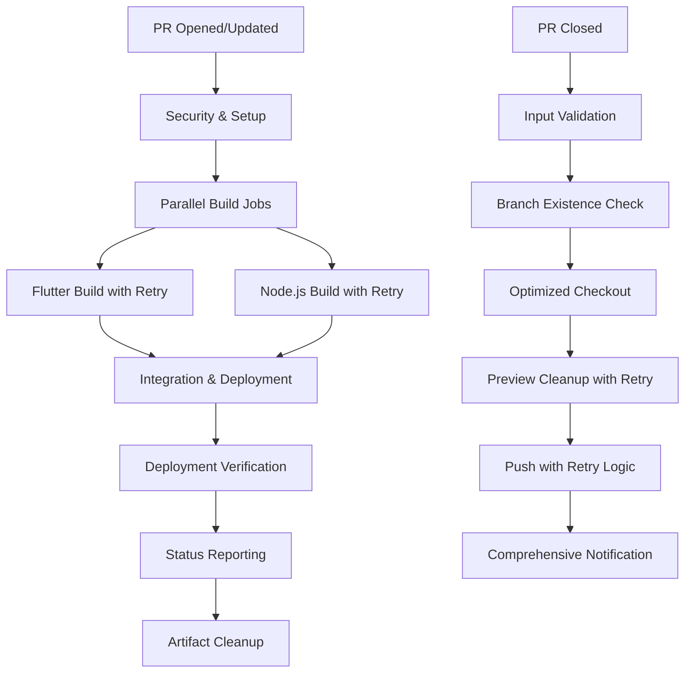

# GitHub Workflows Quick Reference

This is a quick reference guide for the SmartCharts Champion GitHub workflows. For detailed documentation, see [README.md](./README.md).

## 🚀 Workflows Overview

| Workflow | Trigger | Purpose | Duration | Key Features |
|----------|---------|---------|----------|--------------|
| **PR Preview Pages** | PR opened/updated | Builds and deploys preview site with parallel jobs | ~3-5 minutes | Parallel builds, retry logic, verification |
| **Cleanup PR Preview** | PR closed | Removes preview deployment with retry | ~30-60 seconds | Retry logic, validation, comprehensive reporting |

## 📋 Quick Commands

### Manual Workflow Triggers
```bash
# Trigger PR preview build (push to PR branch)
git push origin feature-branch

# Trigger cleanup (close/merge PR)
# No manual command - automatic on PR closure
```

### Local Development
```bash
# Build locally (matches enhanced workflow)
npm ci
npm run build

# Build Flutter component (matches workflow configuration)
cd chart_app
flutter pub get
flutter build web --web-renderer html --release --verbose

# Verify build outputs (matches workflow verification)
ls -la dist/
ls -la chart_app/build/web/
```

## 🔧 Common Issues & Solutions

### Build Failures

| Issue | Enhanced Solution |
|-------|-------------------|
| Flutter build fails | **Auto-retry**: 3 attempts with caching. Check Flutter 3.24.1, clear cache, verify SSH_KEY |
| Node.js build fails | **Auto-retry**: 3 attempts with npm caching. Verify Node.js 18.x, run `npm ci --cache .npm` |
| SSH key errors | **Auto-cleanup**: Secure key handling. Ensure SSH_KEY is PEM format, check permissions |
| Deployment fails | **Retry logic**: 3 attempts with backoff. Check Pages settings, branch protection, permissions |
| Parallel build conflicts | **Resource management**: Jobs run in isolation. Check runner capacity and artifact conflicts |

### Preview Issues

| Issue | Enhanced Solution |
|-------|-------------------|
| Preview URL 404 | **Auto-verification**: 10 retry attempts over 60s. Built-in propagation wait and health checks |
| Preview not updating | **Build verification**: Check workflow logs, artifact integrity, and deployment confirmation |
| Cleanup not working | **Enhanced cleanup**: Retry logic, branch validation, atomic operations with rollback |
| Build statistics missing | **Comprehensive reporting**: Size metrics, file counts, verification status in PR comments |

## 🔐 Required Secrets

| Secret | Purpose | Format |
|--------|---------|--------|
| `SSH_KEY` | Private repository access | SSH private key (PEM format) |
| `GITHUB_TOKEN` | API access | Auto-provided by GitHub |

## 📊 Enhanced Workflow Status

### Check Workflow Status
- Go to **Actions** tab in GitHub repository
- Look for workflow runs with PR number
- **Status Indicators**:
  - Green ✅ = Success with verification
  - Red ❌ = Failed with detailed error reporting
  - Yellow 🟡 = In Progress with real-time updates
  - Blue 🔄 = Retrying (automatic retry in progress)

### Preview URLs & Verification
- **Format**: `https://{owner}.github.io/smartcharts-champion/pr-{number}`
- **Example**: `https://deriv-com.github.io/smartcharts-champion/pr-123`
- **Auto-verification**: URLs are automatically tested for accessibility
- **Build Statistics**: Size, file count, and verification status in PR comments

## 🛠 Enhanced Troubleshooting Steps

### 1. Build Failures (with Auto-Retry)
```bash
# Enhanced workflow includes 3 automatic retry attempts
# Check workflow logs in GitHub Actions tab for:
- Retry attempt details and failure patterns
- Grouped log sections for easier debugging
- Build verification results and artifact integrity

# Enhanced fixes:
- Automatic dependency caching and restoration
- Parallel build isolation prevents conflicts
- SSH key auto-cleanup prevents permission issues
- Build size reporting helps identify bloat issues
```

### 2. Deployment Issues (with Verification)
```bash
# Enhanced deployment includes:
- Automatic retry with exponential backoff (3 attempts)
- Health checks with 10 verification attempts
- 60-second propagation wait time
- Comprehensive error reporting with troubleshooting links

# Verify settings:
# Settings → Pages → Source: "Deploy from a branch"
# Settings → Pages → Branch: gh-pages
# Settings → Actions → General → Workflow permissions: "Read and write"
```

### 3. SSH Key Problems (with Security)
```bash
# Enhanced SSH handling includes:
- Automatic secure cleanup after use
- Permission validation and error reporting
- Known_hosts management

# Generate new SSH key:
ssh-keygen -t rsa -b 4096 -C "github-actions@smartcharts"
# Ensure PEM format and proper line endings
# Add public key to flutter-chart repository
# Add private key to repository secrets as SSH_KEY
```

### 4. Cleanup Issues (with Retry Logic)
```bash
# Enhanced cleanup includes:
- Input validation and PR number verification
- Branch existence checking before operations
- Retry logic for network failures (3 attempts)
- Atomic operations with rollback capabilities
- Comprehensive status reporting

# Manual cleanup if needed:
git checkout gh-pages
git rm -rf pr-preview/{PR_NUMBER}
git commit -m "Manual cleanup of PR #{PR_NUMBER}"
git push origin gh-pages
```

## 📈 Enhanced Performance Tips

### Speed Up Builds (40-50% Faster)
- **Parallel Architecture**: Flutter and Node.js builds run simultaneously
- **Multi-Layer Caching**: npm, Flutter dependencies, and build artifacts
- **Smart Retry Logic**: Prevents full rebuilds for transient failures
- **Artifact Management**: Efficient upload/download with automatic cleanup
- **Sparse Checkout**: Only checks out necessary files for cleanup operations

### Reduce Resource Usage
- **Optimized Dependencies**: Selective caching and restoration
- **Shallow Clones**: Minimal git history for faster operations
- **Automatic Cleanup**: Build artifacts removed after workflow completion
- **Concurrency Control**: Prevents resource conflicts between parallel jobs
- **Efficient Verification**: Health checks with configurable timeout and retry limits

## 🔄 Enhanced Workflow Dependencies



## 📞 Support

### Getting Help
1. **Check workflow logs** in GitHub Actions tab
2. **Review error messages** in PR comments
3. **Consult troubleshooting section** above
4. **Check repository permissions** and secrets

### Enhanced Error Patterns & Auto-Recovery
- `Error: SSH key not found` → **Auto-retry**: Check SSH_KEY secret format (PEM), automatic cleanup
- `Error: Permission denied` → **Enhanced reporting**: Check workflow permissions, branch protection rules
- `Error: Branch not found` → **Auto-validation**: gh-pages branch existence check, automatic creation guidance
- `Error: Build failed` → **Retry logic**: 3 automatic attempts, detailed error context, troubleshooting links
- `Error: Deployment verification failed` → **Health checks**: 10 retry attempts, propagation wait, manual verification URLs
- `Error: Artifact integration failed` → **Integrity checks**: Automatic validation, size reporting, rollback capabilities

---

*For comprehensive documentation, see [README.md](./README.md)*
